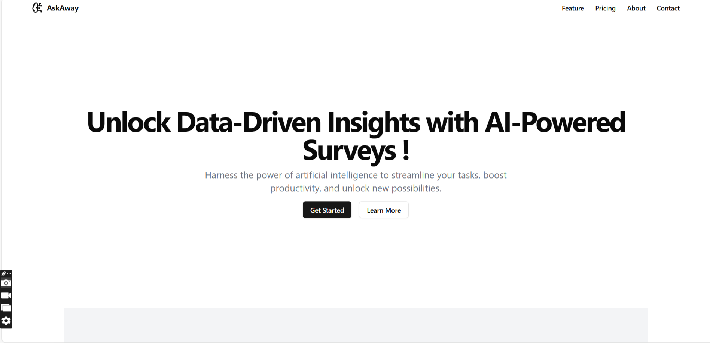

# AskAway: AI-Powered Survey Platform

AskAway is an innovative survey platform that leverages LLMs to generate insightful questions and analyze survey responses. This project combines React for the frontend, Firebase for authentication and data storage for intelligent survey generation and analysis.

**This project was created with the assistance of AI tools, Cursor AI and Claude-3.5-Sonnet to streamline development and enhance code generation.**




## Features

- AI-powered survey question generation
- Intelligent analysis of survey responses
- User authentication (login and registration)
- Responsive design for various devices
- Protected routes for authenticated users

## Tech Stack

- React
- TypeScript
- Vite
- Firebase (Authentication and Firestore)
- Google Gemini for natural language interaction
- Tailwind CSS
- Shadcn UI Components
- Framer Motion for animations


## Getting Started

1. Clone the repository
2. Install dependencies:
   ```
   npm install
   ```
3. Set up your Firebase project and update the configuration in `config/firebase.config.ts`
4. Set up your Google Generative AI API key 
5. Run the development server:
   ```
   npm run dev
   ```

## Key Components

### Survey Generation
This component uses Google's Generative AI to create survey questions based on selected topics.

### Survey Analysis
This component collects survey responses and uses AI to provide an analysis of the results.

### Authentication
These components handle user login and registration using Firebase Authentication.

## Deployment
To build the project for production:
```
npm run build
```
Deploy the contents of the dist folder to your preferred hosting platform.

## Contributing

<<<<<<< HEAD
Contributions are welcome! Please feel free to fork and submit a Pull Request.
=======
Contributions are welcome! Please feel free to fork and submit a Pull Request.
>>>>>>> 05a95a0f4dc69586c9459fe454ed9eea564e52c8
